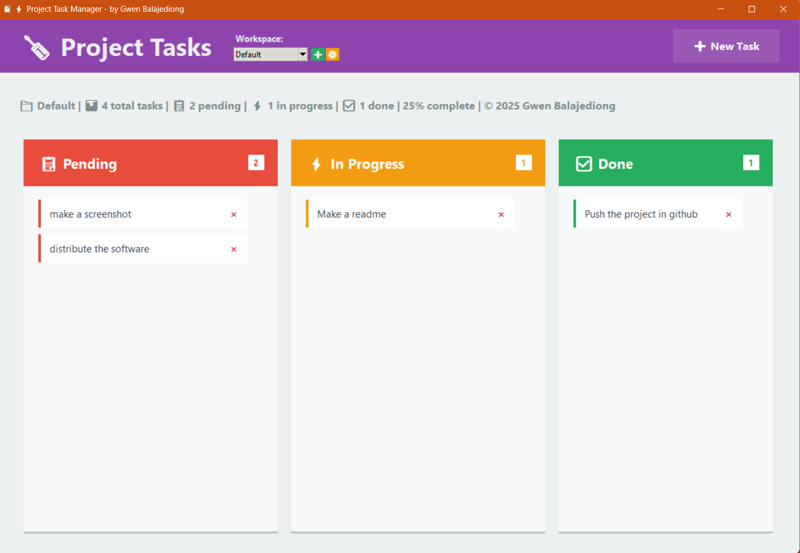
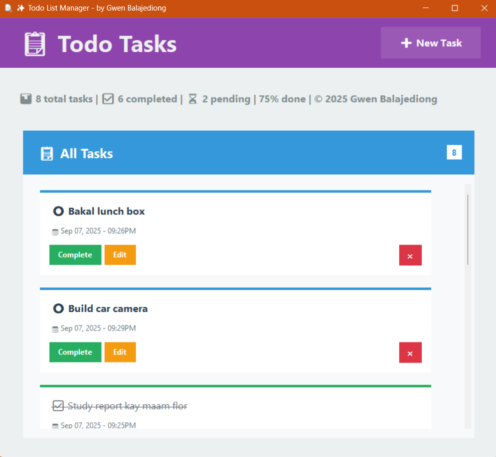

# Python ToDo List and Kanban Software Application

A modern, simple productivity suite by **Gwen Balajediong**.  
Manage your projects and todos with a beautiful, intuitive interface inspired by Kanban and Trello boards.




## Features

- 🗂️ **Project Task Manager**: 3-column Kanban board for organizing tasks by workspace/project.
- ✅ **Todo List Manager**: Simple, elegant single-column todo app.
- 🖼️ **Custom Icons**: Distinctive icons for each app and workspace.
- 💾 **Data Storage**: All data is securely stored in your `Documents/GwenProject/` folder.
- 🔒 **Standalone Executables**: No Python required to run—just download and go!
- 🎨 **Modern UI**: Clean, responsive design with smooth scrolling and stylish dialogs.
- 📝 **Workspace Management**: Easily switch between multiple projects or workspaces.
- 📊 **Statistics**: See your progress and workspace name at a glance.

## Getting Started

1. **Download the latest release** from [Releases](https://github.com/gwenz2/python-todo-kanban-app/releases).
2. **Run the executable** (`TodoListManager.exe` or `ProjectTaskManager.exe`).
3. Your data will be saved in `Documents/GwenProject/`.


## Build from Source

1. Clone the repository:
   ```sh
   git clone https://github.com/gwenz2/python-todo-kanban-app.git
   cd python-todo-kanban-app
   ```
2. Install Python 3.10+ and required packages:
   ```sh
   pip install -r requirements.txt
   ```
3. Run the app:
   ```sh
   python to-do-list.py
   # or
   python notes.py
   ```
4. To build executables, use the provided `build_secure.bat` script.


## License

```
Copyright (c) 2025 Gwen Balajediong
All rights reserved.
```

---

> _Made with ❤️ by Gwen Balajediong_
